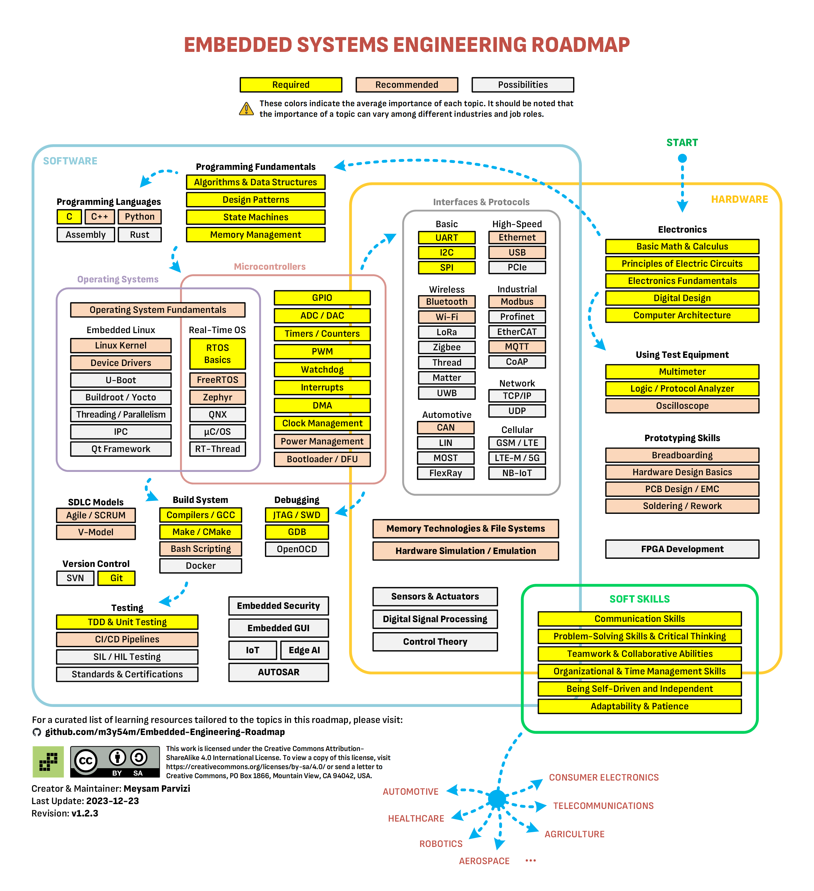

# -EmbeddedSystems
All About  Embedded Systems

### Picture will modify later based on the content. 

# 📘 Embedded Systems & Automotive Engineering Knowledge Base

A comprehensive, continuously evolving repository documenting **Embedded Systems**, **Automotive Electronics**, **Computer Architecture**, **RTOS**, **MCU/SoC internals**, **communication protocols**, and **core algorithms** with both **Markdown theory** and **C implementations**.

This project serves as a long‑term technical reference, interview preparation resource, and engineering notebook.

---

## 📚 Major Sections

### 1. Programming & Fundamentals
- **[Programming Fundamentals](ca://s?q=Open_Programming_Fundamentals.md)**
- **[Programming Basics](ca://s?q=Open_programming_basics.md)**
- **[Process](ca://s?q=Open_Process.md)**
- **[Memory Layout](ca://s?q=Open_memory_layout.md)**
- **[Memory Hierarchy](ca://s?q=Open_memory_heirarchy.md)**

---

### 2. Algorithms & Data Structures
- **[Algorithm & Data Structure Notes](ca://s?q=Open_Algorithm_and_DataStructure.md)**
- Arrays — [array_operations.c](ca://s?q=Open_array_operations.c)
- Linked Lists — [LinkedList.md](ca://s?q=Open_LinkedList.md), [LinkedList.c](ca://s?q=Open_LinkedList.c)
- Stacks & Queues — [stack_and_queue.md](ca://s?q=Open_stack_and_queue.md), [stack_and_queue.c](ca://s?q=Open_stack_and_queue.c)
- Recursion — [recursive_programming.md](ca://s?q=Open_recursive_programming.md), [recursive_programming.c](ca://s?q=Open_recursive_programming.c)
- Trees — [Trees.md](ca://s?q=Open_Trees.md), [trees.c](ca://s?q=Open_trees.c)
- Graphs — [Graphs.md](ca://s?q=Open_Graphs.md), [Graphs.c](ca://s?q=Open_Graphs.c)
- Hash Tables — [hash_tables.md](ca://s?q=Open_hash_tables.md), [hash_table.c](ca://s?q=Open_hash_table.c)

---

### 3. Embedded Systems Architecture
- **[Embedded Systems Core](ca://s?q=Open_embedded_system_core.md)**
- **[Embedded Systems Detail](ca://s?q=Open_embedded_systems_detail.md)**
- **[Embedded Systems Interface](ca://s?q=Open_Embedded_Systems_Interface.md)**
- **[Advanced Embedded](ca://s?q=Open_advanced_embedded.md)**
- **[EE Architecture](ca://s?q=Open_EE_Architecture.md)**

---

### 4. MCU / SoC Architecture
- ARM Cortex Series  
  - [Cortex‑A](ca://s?q=Open_arm_cortex_a_architecture.md)  
  - [Cortex‑M](ca://s?q=Open_arm_cortex_m_architecture.md)  
  - [Cortex‑R](ca://s?q=Open_arm_cortex_r_architecture.md)

- **[MCU Overview](ca://s?q=Open_mcu.md)**
- **[MPU](ca://s?q=Open_MPU.md)**
- **[DMA](ca://s?q=Open_DMA.md)**
- **[ADC](ca://s?q=Open_ADC.md)**
- **[DSP Architecture](ca://s?q=Open_DSP_architecture.md)**

---

### 5. Computer Architecture
- **[Computer Architecture](ca://s?q=Open_computer_architecture.md)**
- **[CPU Pipeline](ca://s?q=Open_cpu_pipeline.md)**
- **[Pipeline Hazards](ca://s?q=Open_pipeline_hazards.md)**
- **[Pipelining Summary](ca://s?q=Open_Pipelining.md)**
- **[Memory Hierarchy](ca://s?q=Open_memory_heirarchy.md)**

---

### 6. Operating Systems & Virtualization
- **[OS Architecture](ca://s?q=Open_os_architecture.md)**
- **[RTOS](ca://s?q=Open_rtos.md)**
- **[RTOS Basics](ca://s?q=Open_rtos_basics.md)**
- **[POSIX](ca://s?q=Open_posix.md)**
- **[VM](ca://s?q=Open_VM.md)**
- **[Hypervisor](ca://s?q=Open_Hypervisor.md)**
- **[QNX Boot Sequence](ca://s?q=Open_qnx_boot_sequence.md)**

---

### 7. Automotive Systems
- **[Functional Safety](ca://s?q=Open_Functional_Safety.md)**
- **[ISO 26262](ca://s?q=Open_iso26262.md)**
- **[Autosar Partitioning](ca://s?q=Open_autosar_partitioning.md)**
- **[Zonal Architecture](ca://s?q=Open_zonal_architecture.md)**
- **[IVI Architecture](ca://s?q=Open_ivi.md)**
- **[OTA](ca://s?q=Open_ota.md)**
- **[Parallel Executions](ca://s?q=Open_parallel_executions.md)**
- **[Low Power Architecture](ca://s?q=Open_low_power_architecture.md)**

---

### 8. Automotive Communication Protocols
- **[CAN](ca://s?q=Open_CAN.md)**
- **[LIN](ca://s?q=Open_LIN.md)**
- **[I2C](ca://s?q=Open_I2C.md)**
- **[SPI](ca://s?q=Open_SPI.md)**
- **[UART](ca://s?q=Open_UART.md)**
- **[UDS](ca://s?q=Open_unified_diagnostics_services.md)**

C Implementations:
- [i2c.c](ca://s?q=Open_i2c.c)
- [spi.c](ca://s?q=Open_spi.c)
- [UART.c](ca://s?q=Open_UART.c)

---

### 9. Graphics & Camera
- **[Graphic Architecture Example](ca://s?q=Open_Graphic_Architecture_Example.md)**
- **[Camera Integration](ca://s?q=Open_camera_integration.md)**

---

### 10. Performance & Build
- **[Performance Tuning](ca://s?q=Open_performance_tuning.md)**
- **[Build Methods](ca://s?q=Open_Build_methods.md)**

---

### 11. Safety & Diagnostics
- **[Watchdog](ca://s?q=Open_watchdog.md)**
- **[Ecc Simulation](ca://s?q=Open_Ecc_Simulation.c)**

---

## 🧠 Purpose of This Repository
This repository is designed as:

- A **complete embedded‑systems engineering knowledge base**
- A **reference library** for interviews, projects, and system design
- A **learning journal** documenting deep‑dive studies
- A **C implementation archive** for low‑level programming

---

## 🚀 How to Use This Repository
1. Start with **Programming Fundamentals**
2. Move into **Embedded Systems Architecture**
3. Study **MCU/SoC internals**
4. Explore **Automotive protocols & safety**
5. Deep dive into **OS, RTOS, Hypervisors**
6. Use C files to understand **low‑level implementation**

---

## 📈 Planned Additions
- Sorting algorithms  
- AVL, Red‑Black Trees  
- Advanced graph algorithms  
- Dynamic programming  
- Automotive Ethernet (TSN/AVB)  
- ROS2 / Apex.OS notes  

---

## 📬 Contact
For collaboration or questions, feel free to reach out.

