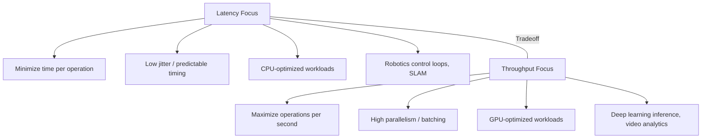

# Jetson Performance Tuning Guide  
*Practical notes for CUDA, robotics, and deep learning on NVIDIA Jetson*

This guide summarizes concrete, architecture-aware tuning strategies for NVIDIA Jetson platforms (Nano, TX2, Xavier, Orin), focusing on:
- CUDA kernels  
- Robotics/control workloads  
- Deep learning inference  
- Memory and cache behavior  

---

# 1. Understand Your Bottleneck

Before tuning, identify whether your workload is:
- **Compute-bound** (ALUs/Tensor Cores saturated)
- **Memory-bound** (DRAM or L2 saturated)
- **Latency-bound** (cache misses, synchronization)
- **I/O-bound** (camera, disk, network)

### Tools
- `tegrastats`
- `nvpmodel` + `jetson_clocks`
- Nsight Systems / Nsight Compute
- `watch -n 0.5 tegrastats`

**Rule:** Never tune blindly—measure first.

---

# 2. Power Modes and Clocks

Jetson modules support multiple power/performance modes.

### Steps
- Use `sudo nvpmodel -q` to check current mode.
- Use `sudo nvpmodel -m <mode>` to select a higher performance profile.
- Use `sudo jetson_clocks` to lock clocks for consistent benchmarking.

### Notes
- Higher modes → more power, more heat.
- Ensure adequate cooling (heatsink, fan) to avoid thermal throttling.

**Tip:** For benchmarking and tuning, always enable `jetson_clocks`.

---

# 3. CUDA Kernel Optimization

## 3.1 Use Shared Memory Effectively
- Load reused data into **shared memory**.
- Avoid repeated global memory reads.
- Align shared memory access to avoid bank conflicts.

### Good Use Cases
- Convolutions
- Matrix multiplication
- Block matching (stereo)
- Local window operations

---

## 3.2 Optimize Memory Access Patterns
- Ensure **coalesced global memory access**:
  - Threads in a warp should access consecutive addresses.
- Avoid strided or random access patterns.
- Use `float4`, `int4` where appropriate for vectorized loads.

---

## 3.3 Control Occupancy
- Balance:
  - Threads per block
  - Registers per thread
  - Shared memory per block
- Use `nvcc --ptxas-options=-v` to inspect register usage.
- Use Nsight Compute to analyze occupancy.

**Rule:** Maximum occupancy is not always maximum performance—prioritize memory efficiency.

---

# 4. Deep Learning Inference Tuning

## 4.1 Use TensorRT
- Convert models (ONNX, PyTorch, TF) to TensorRT engines.
- Enable:
  - FP16 on Nano/TX2/Xavier/Orin
  - INT8 on Xavier/Orin (with calibration)

### Benefits
- Layer fusion
- Kernel auto-tuning
- Reduced memory footprint
- Higher FPS

---

## 4.2 Batch Size and Resolution
- Increase **batch size** to improve GPU utilization (if latency allows).
- Reduce **input resolution** if FPS is more important than accuracy.
- For real-time robotics:
  - Prefer smaller models (YOLO-tiny, MobileNet, etc.)
  - Use FP16/INT8 where possible.

---

## 4.3 Orin-Specific Tuning
- Orin has much higher DRAM bandwidth.
- You can:
  - Run larger models (YOLOv8, Transformers).
  - Run multiple models in parallel.
  - Use higher resolutions (1080p, 4K).

**Tip:** On Orin, you’re more likely to be compute-bound than memory-bound.

---

# 5. Robotics and Real-Time Workloads

## 5.1 CPU Core Affinity and Isolation
- Pin critical threads (control loops, SLAM) to specific CPU cores.
- Avoid running heavy background tasks on the same cores.
- Use `taskset` or `cgroups` to manage CPU affinity.

---

## 5.2 Use PREEMPT_RT (If Needed)
- For hard real-time requirements:
  - Use a PREEMPT_RT patched kernel.
  - Prioritize control threads with real-time scheduling (`SCHED_FIFO`).

---

## 5.3 Minimize Jitter
- Keep control loop working sets in **CPU L2**.
- Avoid dynamic memory allocation in real-time loops.
- Avoid blocking I/O in critical threads.

**Rule:** Determinism > raw speed for control.

---

# 6. Memory and Zero-Copy Tuning

## 6.1 Use Pinned (Page-Locked) Memory
- For CPU↔GPU transfers, use pinned memory:
  - Faster DMA transfers
  - More predictable latency

---

## 6.2 Zero-Copy Buffers
- Use zero-copy for:
  - Camera frames
  - Sensor data
  - VPI pipelines
- Avoid unnecessary `cudaMemcpy`.

### Synchronization Requirements
- Use:
  - `cudaDeviceSynchronize()`
  - CUDA streams + events
  - `__threadfence_system()`
- Ensure CPU does not read/write while GPU is using the buffer (and vice versa).

---

# 7. Jetson-Specific Tips

## 7.1 Use Hardware Accelerators
- Use:
  - NVDLA for DNN inference (where supported)
  - PVA for vision tasks
  - NVENC/NVDEC for video encoding/decoding
- Offload work from CPU/GPU when possible.

---

## 7.2 Optimize GStreamer Pipelines
- Use hardware-accelerated elements:
  - `nvvidconv`
  - `nvv4l2decoder`
  - `nvv4l2h264enc` / `nvv4l2h265enc`
- Keep frames in NVMM (zero-copy) where possible.

---

## 7.3 Monitor and Iterate
- Continuously monitor:
  - CPU/GPU utilization
  - Memory bandwidth
  - Temperature
  - Power draw
- Use `tegrastats` during real workloads, not just synthetic tests.

---

# 8. Quick Checklist

- [ ] Set appropriate `nvpmodel` mode  
- [ ] Run `jetson_clocks` for consistent performance  
- [ ] Use TensorRT for inference  
- [ ] Use shared memory in CUDA kernels  
- [ ] Ensure coalesced global memory access  
- [ ] Pin critical threads to specific CPU cores  
- [ ] Use pinned memory for transfers  
- [ ] Use zero-copy where appropriate (with proper sync)  
- [ ] Offload to NVDLA/PVA/NVENC/NVDEC when possible  
- [ ] Monitor with `tegrastats` and Nsight tools  

---

# 9. Final Thoughts

Jetson performance tuning is about:
- Respecting the **memory hierarchy**  
- Exploiting **shared memory and caches**  
- Matching **model size** to **bandwidth and compute**  
- Designing for **determinism** in robotics workloads  


# Throughput vs Latency Tradeoffs  
*A computer‑architecture perspective*

Throughput and latency are two fundamental performance metrics in computing systems.  
They often move in opposite directions — improving one can worsen the other.  
Understanding this tradeoff is essential for optimizing CPUs, GPUs, CUDA kernels, robotics loops, and deep learning inference on Jetson platforms.

---

# 1. Definitions

## 1.1 Latency  
Latency is the **time it takes to complete a single operation**.

Examples:
- Time to fetch one value from memory  
- Time for one CUDA thread to finish a task  
- Time for a control loop iteration  

Latency is measured in:
- Nanoseconds  
- CPU cycles  
- Milliseconds (for robotics loops)

---

## 1.2 Throughput  
Throughput is the **number of operations completed per unit time**.

Examples:
- Frames per second (FPS) in inference  
- Number of CUDA threads completed per second  
- Number of packets processed per second  

Throughput is measured in:
- Operations per second  
- GB/s  
- FPS  

---

# 2. Why They Trade Off

Improving latency often requires:
- More complex hardware  
- Larger caches  
- Deeper pipelines  
- More control logic  

These increase:
- Power consumption  
- Area  
- Cost  

Improving throughput often requires:
- More parallelism  
- More cores/SMs  
- Wider memory buses  
- Batch processing  

These can increase:
- Per‑operation latency  
- Queueing delays  
- Synchronization overhead  

**Key idea:**  
> Latency is about *how fast one thing finishes*.  
> Throughput is about *how many things finish per second*.  
> Optimizing for one often hurts the other.

---

# 3. CPU vs GPU: A Perfect Example

## CPU (Latency‑Optimized)
- Few, powerful cores  
- Sophisticated branch prediction  
- Large caches  
- Out‑of‑order execution  
- Low‑latency memory access  

**Goal:** Minimize the time for a single thread to finish.

---

## GPU (Throughput‑Optimized)
- Many simple cores (SMs)  
- Massive parallelism  
- High memory bandwidth  
- Simple control logic  
- High latency tolerated  

**Goal:** Maximize total operations per second, not minimize per‑thread latency.

---

# 4. Jetson-Specific Examples

## 4.1 CUDA Kernels  
- GPUs hide latency by running thousands of threads.  
- If one warp stalls, another warp runs.  
- Latency per thread is high, but throughput is enormous.

**Tradeoff:**  
- High throughput  
- High per-thread latency  

---

## 4.2 Robotics Control Loops  
- Require low latency and low jitter.  
- Throughput is irrelevant — only the *next* control update matters.

**Tradeoff:**  
- Low latency  
- Low throughput (only one loop at a time)

---

## 4.3 Deep Learning Inference  
- GPUs process many pixels/tensors in parallel.  
- Batch size increases throughput but increases latency.

**Example:**  
- Batch size 1 → low latency, low throughput  
- Batch size 16 → high throughput, high latency  

---

## 4.4 Jetson Orin vs Nano  
- Orin has huge memory bandwidth → high throughput  
- Nano has lower bandwidth → lower throughput  
- Latency per memory access is similar, but Orin can process far more data per second.

---

# 5. Practical Tradeoffs in Real Systems

## 5.1 When to Optimize for Latency
- Robotics control loops  
- Real-time SLAM  
- Sensor fusion  
- Safety-critical systems  
- Interactive applications  

**Goal:** Minimize delay.

---

## 5.2 When to Optimize for Throughput
- Deep learning inference  
- Video analytics  
- CUDA batch processing  
- Offline training  
- High‑volume data pipelines  

**Goal:** Maximize total work done.

---

# 6. Summary Table

| Metric | Latency | Throughput |
|--------|---------|------------|
| Meaning | Time for one operation | Operations per second |
| Optimized by | CPUs, control loops | GPUs, batch processing |
| Jetson Example | SLAM loop | TensorRT inference |
| Improves | Responsiveness | Total performance |
| Hurts | Throughput | Latency |

---

# 7. Key Takeaway

> **Latency is about speed of one task.  
> Throughput is about speed of many tasks.  
> CPUs optimize latency; GPUs optimize throughput.  
> Jetson workloads must choose based on application needs.**


Small, architecture-aware changes often yield large, measurable gains.

# 1. Mermaid Diagram — Latency vs Throughput


# 2. Jetson-Specific Tuning Guide for Latency-Sensitive Robotics

### Goal

- Ensure deterministic timing, low jitter, and predictable memory access for control loops, SLAM, and sensor fusion.
### 2.1 CPU Core Management
  - Pin real-time threads to isolated CPU cores
    - Avoid sharing cores with:
        - TensorRT inference
        - GStreamer pipelines
        - ROS2 executors
    - Use taskset or cgroups for affinity control
    - Disable CPU frequency scaling for critical cores
    - Use jetson_clocks for stable frequency
### 2.2 Memory Behavior
    - Keep working sets inside CPU L2 cache
    - Avoid dynamic memory allocation inside loops
    - Pre-allocate buffers at startup
    - Use lock-free queues for sensor data
    - Avoid DRAM-heavy operations (sorting, large copies)

### 2.3 Real-Time Kernel Options
    - Use PREEMPT_RT kernel if hard real-time is required
    - Set thread scheduling to:
        - SCHED_FIFO
        - SCHED_RR
    - Prioritize:
        - Control loops
        - Sensor fusion
        - State estimation
### 2.4 Sensor Pipeline Optimization
    - Use zero-copy camera buffers (NVMM)
    - Avoid CPU image copies
    - Use VPI for:
        - Image rectification
        - Optical flow
        - Stereo disparity
    - Use hardware accelerators (PVA, ISP) when possible
### 2.5 Avoiding GPU Interference
    - GPU workloads can cause DRAM contention
    - For latency-sensitive tasks:
        - Run inference on NVDLA (Xavier/Orin)
        - Reduce GPU batch size
        - Use lower-resolution models
    - Separate CPU and GPU memory traffic where possible
### 2.6 Monitoring
    - Use tegrastats to monitor:
        - DRAM bandwidth
        - CPU load
        - GPU load
        - Temperature
    - Watch for:
        - DRAM saturation
        - Thermal throttling
        - CPU frequency drops
## 3. Throughput Optimization Checklist for CUDA/TensorRT
### 3.1 CUDA Kernel Throughput
    - [ ] Use shared memory to reduce DRAM access
    - [ ] Ensure coalesced global memory loads
    - [ ] Use vectorized loads (float4, int4)
    - [ ] Avoid warp divergence
    - [ ] Maximize occupancy (but not blindly)
    - [ ] Use asynchronous streams for overlap
    - [ ] Use pinned memory for transfers
    - [ ] Fuse kernels where possible
    - [ ] Prefer half precision (FP16) or INT8
### 3.2 TensorRT Throughput
    - [ ] Convert models to TensorRT engines
    - [ ] Enable FP16 or INT8 precision
    - [ ] Increase batch size (if latency allows)
    - [ ] Use DLA cores on Xavier/Orin
    - [ ] Use layer fusion and tactic selection
    - [ ] Keep input/output tensors in GPU memory
    - [ ] Avoid CPU post-processing
    - [ ] Use CUDA graphs for repeated inference
### 3.3 DRAM & Bandwidth Optimization
    - [ ] Minimize DRAM traffic
    - [ ] Reuse tensors instead of reallocating
    - [ ] Use workspace memory efficiently
    - [ ] Avoid unnecessary CPU↔GPU transfers
    - [ ] Use zero-copy buffers for camera input
### 3.4 Pipeline-Level Throughput
    - [ ] Use GStreamer hardware decoders (nvv4l2decoder)
    - [ ] Use NVENC/NVDEC for video
    - [ ] Use DeepStream for multi-stream analytics
    - [ ] Use CUDA streams to overlap:
        - Preprocessing
        - Inference
        - Postprocessing
# Summary Table


# CUDA Optimization Cheat Sheet  
*Practical, architecture-aware tips (Jetson-friendly)*

---

## 1. Memory Access

### 1.1 Global Memory
- **Coalesce accesses**  
  - Threads in a warp should access consecutive addresses.  
  - Avoid strided or random access patterns.
- **Use vectorized loads**  
  - Prefer `float2`, `float4`, `int4` when alignment allows.
- **Minimize global memory traffic**  
  - Reuse data via shared memory or registers.  
  - Avoid redundant loads.

---

### 1.2 Shared Memory
- **Use shared memory for data reuse**  
  - Tiles for matrix multiplication, convolutions, block matching, etc.
- **Avoid bank conflicts**  
  - Access different banks per thread when possible.  
  - Use padding in shared memory arrays if needed.
- **Load once, reuse many times**  
  - Especially for stencil, convolution, and neighborhood operations.

---

### 1.3 Registers
- **Keep hot data in registers**  
  - Avoid spilling to local memory.  
- **Watch register pressure**  
  - Too many registers per thread reduces occupancy.  
  - Use `nvcc --ptxas-options=-v` to inspect register usage.

---

## 2. Threading & Occupancy

### 2.1 Block and Grid Configuration
- Use **multiples of 32 threads per block** (warp size).  
- Common choices: 128, 256, 512 threads per block.  
- Tune block size based on:
  - Shared memory usage  
  - Register usage  
  - Occupancy reports (Nsight Compute)

---

### 2.2 Occupancy
- **High occupancy helps hide latency**, but:
  - Maximum occupancy ≠ maximum performance.
- Balance:
  - Registers per thread  
  - Shared memory per block  
  - Threads per block  

---

### 2.3 Warp-Level Behavior
- Avoid **warp divergence**:
  - Minimize `if/else` where threads in a warp take different paths.  
  - Use predication or warp-level primitives where possible.
- Use **warp intrinsics**:
  - `__shfl_sync`, `__ballot_sync`, etc. for fast intra-warp communication.

---

## 3. Kernel Design

### 3.1 Minimize Kernel Launch Overhead
- Fuse small kernels when possible.  
- Use **CUDA Graphs** for repeated workloads.  
- Avoid launching many tiny kernels.

---

### 3.2 Arithmetic Intensity
- Increase **compute per byte loaded** from memory.  
- Prefer algorithms with high reuse of loaded data.  
- Example: block tiling in GEMM, convolution.

---

### 3.3 Precision
- Use **FP16** or **INT8** when acceptable:
  - Higher throughput  
  - Lower memory bandwidth  
  - Better cache utilization  

---

## 4. Asynchrony & Overlap

### 4.1 Streams
- Use **multiple CUDA streams** to overlap:
  - Data transfers  
  - Kernel execution  
  - Pre/post-processing  
- Ensure operations in different streams are independent.

---

### 4.2 Async Memory Copies
- Use `cudaMemcpyAsync` with pinned memory.  
- Overlap host↔device transfers with kernel execution.

---

## 5. Host–Device Interaction

### 5.1 Pinned Memory
- Use **page-locked (pinned) memory** for:
  - Faster and more predictable transfers.  
- Avoid overusing pinned memory (it reduces overall system flexibility).

---

### 5.2 Zero-Copy (Jetson/Unified Memory)
- Use zero-copy for:
  - Camera frames  
  - Sensor data  
- Always ensure **proper synchronization**:
  - `cudaDeviceSynchronize()`  
  - Streams + events  
  - `__threadfence_system()`  

---

## 6. Profiling & Tools

### 6.1 Nsight Tools
- **Nsight Systems**:
  - Timeline view, CPU–GPU overlap, stream usage.  
- **Nsight Compute**:
  - Memory throughput  
  - Occupancy  
  - Warp efficiency  
  - Cache hit rates  

---

### 6.2 Quick Checks
- Is global memory coalesced?  
- Is shared memory used where there is reuse?  
- Is occupancy reasonable (not extremely low)?  
- Are there many divergent branches?  
- Is DRAM bandwidth saturated?

---

## 7. Jetson-Specific Notes

- Use `jetson_clocks` for consistent performance during profiling.  
- Be aware of **DRAM bandwidth limits** (especially on Nano/TX2).  
- On Orin/Xavier:
  - Consider using **Tensor Cores** (FP16/INT8).  
  - Use **DLA** for offloading inference where possible.  

---

## 8. Quick Checklist

- [ ] Coalesced global memory access  
- [ ] Shared memory used for data reuse  
- [ ] No major shared memory bank conflicts  
- [ ] Reasonable occupancy (not register-starved)  
- [ ] Minimal warp divergence  
- [ ] Asynchronous transfers with streams  
- [ ] Pinned memory for host↔device transfers  
- [ ] Zero-copy used appropriately (with sync)  
- [ ] Profiled with Nsight to confirm bottlenecks  
# NVIDIA Jetson Performance Handbook  
*A complete guide for optimizing CUDA, deep learning, and robotics workloads*

This handbook provides a comprehensive overview of performance tuning on NVIDIA Jetson platforms (Nano, TX2, Xavier, Orin).  
It covers CPU, GPU, memory, accelerators, CUDA kernels, deep learning inference, robotics workloads, and system-level optimization.

---

# Table of Contents
1. Jetson Architecture Overview  
2. Power Modes & Thermal Management  
3. CPU Performance Tuning  
4. GPU & CUDA Optimization  
5. Deep Learning Inference Optimization  
6. Robotics & Real-Time Tuning  
7. Memory, DRAM & Zero-Copy Optimization  
8. Hardware Accelerators (DLA, PVA, NVENC/NVDEC)  
9. GStreamer & Multimedia Performance  
10. Profiling Tools & Debugging  
11. Performance Checklists  
12. Summary Tables  

---

# 1. Jetson Architecture Overview

## 1.1 Key Components
- ARM CPU cluster (A57, A72, Carmel, A78AE)
- NVIDIA GPU (Maxwell, Pascal, Volta, Ampere)
- Unified DRAM (LPDDR4/LPDDR5)
- Hardware accelerators:
  - NVDLA (Deep Learning Accelerator)
  - PVA (Vision Accelerator)
  - ISP (Image Signal Processor)
  - NVENC/NVDEC (Video encoder/decoder)

## 1.2 Unified Memory Architecture
- CPU, GPU, and accelerators share the same DRAM.
- No PCIe transfer overhead.
- Zero-copy buffers possible.

---

# 2. Power Modes & Thermal Management

## 2.1 Power Modes
Use:
```
sudo nvpmodel -q
sudo nvpmodel -m <mode>
```

## 2.2 Locking Clocks
```
sudo jetson_clocks
```

## 2.3 Thermal Considerations
- Use active cooling for sustained performance.
- Monitor with `tegrastats`.

---

# 3. CPU Performance Tuning

## 3.1 Core Affinity
- Pin critical threads using `taskset` or ROS2 executor affinity.
- Avoid mixing heavy GPU workloads on the same CPU cores.

## 3.2 Scheduling
- Use `SCHED_FIFO` or `SCHED_RR` for real-time loops.
- Avoid blocking I/O in control threads.

## 3.3 Cache Locality
- Keep working sets inside CPU L2.
- Pre-allocate memory to avoid heap fragmentation.

---

# 4. GPU & CUDA Optimization

## 4.1 Memory Access
- Coalesce global memory loads.
- Use shared memory for data reuse.
- Avoid shared memory bank conflicts.
- Use vectorized loads (`float4`, `int4`).

## 4.2 Occupancy
- Tune threads per block (128–512 typical).
- Balance register usage and shared memory.

## 4.3 Warp Efficiency
- Avoid warp divergence.
- Use warp intrinsics (`__shfl_sync`, `__ballot_sync`).

## 4.4 Asynchronous Execution
- Use CUDA streams to overlap:
  - Preprocessing
  - Kernel execution
  - Postprocessing

---

# 5. Deep Learning Inference Optimization

## 5.1 TensorRT
- Convert models to TensorRT engines.
- Enable FP16 or INT8 precision.
- Use DLA cores on Xavier/Orin.

## 5.2 Batch Size
- Larger batch → higher throughput.
- Smaller batch → lower latency.

## 5.3 Model Selection
- Nano/TX2: use lightweight models (YOLO-tiny, MobileNet).
- Xavier/Orin: can run larger models (YOLOv8, Transformers).

---

# 6. Robotics & Real-Time Tuning

## 6.1 Deterministic Behavior
- Isolate CPU cores for control loops.
- Avoid DRAM-heavy operations in real-time threads.

## 6.2 Sensor Pipelines
- Use zero-copy camera buffers (NVMM).
- Use VPI for:
  - Image rectification
  - Optical flow
  - Stereo disparity

## 6.3 Avoid GPU Interference
- GPU workloads can cause DRAM contention.
- Use DLA for inference when possible.

---

# 7. Memory, DRAM & Zero-Copy Optimization

## 7.1 DRAM Bandwidth
- Nano: ~25 GB/s  
- TX2: ~59 GB/s  
- Xavier: ~137 GB/s  
- Orin: ~204–275 GB/s  

## 7.2 Zero-Copy Buffers
- Avoid CPU↔GPU memcpy.
- Use proper synchronization:
  - `cudaDeviceSynchronize()`
  - CUDA events
  - `__threadfence_system()`

## 7.3 Pinned Memory
- Use pinned memory for faster DMA transfers.

---

# 8. Hardware Accelerators

## 8.1 NVDLA (Xavier/Orin)
- Offload DNN inference.
- Supports INT8/FP16.

## 8.2 PVA
- Optical flow
- Feature tracking
- Stereo vision

## 8.3 NVENC/NVDEC
- Hardware video encoding/decoding.
- Use GStreamer accelerated elements.

---

# 9. GStreamer & Multimedia Performance

## 9.1 Use Hardware-Accelerated Elements
- `nvv4l2decoder`
- `nvv4l2h264enc`
- `nvvidconv`

## 9.2 Keep Frames in NVMM
- Avoid CPU copies.
- Use zero-copy pipelines.

---

# 10. Profiling Tools & Debugging

## 10.1 Nsight Systems
- Timeline view
- CPU–GPU overlap
- Stream usage

## 10.2 Nsight Compute
- Memory throughput
- Warp efficiency
- Occupancy
- Cache hit rates

## 10.3 tegrastats
- DRAM bandwidth
- CPU/GPU load
- Temperature

---

# 11. Performance Checklists

## 11.1 CUDA Checklist
- [ ] Coalesced memory access  
- [ ] Shared memory used  
- [ ] No major bank conflicts  
- [ ] Reasonable occupancy  
- [ ] Minimal warp divergence  
- [ ] Async streams used  
- [ ] Pinned memory for transfers  

## 11.2 Robotics Checklist
- [ ] Core affinity set  
- [ ] Real-time scheduling  
- [ ] Pre-allocated buffers  
- [ ] Zero-copy camera pipeline  
- [ ] Avoid GPU contention  

## 11.3 Deep Learning Checklist
- [ ] TensorRT engine  
- [ ] FP16/INT8 enabled  
- [ ] Batch size tuned  
- [ ] DLA used (if available)  
- [ ] Pre/post-processing on GPU  

---

# 12. Summary Tables

## 12.1 Latency vs Throughput

| Category | Focus |
|----------|--------|
| Latency-sensitive robotics | Predictability, low jitter, CPU L2 locality |
| Throughput optimization | Parallelism, batching, GPU utilization |
| Mermaid diagram | Visualizes the latency–throughput tradeoff |

## 12.2 Jetson DRAM Bandwidth

| Device | Bandwidth |
|--------|-----------|
| Nano | ~25 GB/s |
| TX2 | ~59 GB/s |
| Xavier | ~137 GB/s |
| Orin | ~204–275 GB/s |

---

# Final Notes

Jetson performance tuning is about:
- Understanding the memory hierarchy  
- Using shared memory and caches effectively  
- Matching model size to bandwidth and compute  
- Designing for determinism in robotics  
- Leveraging hardware accelerators  
- Profiling continuously  

Small, architecture-aware optimizations often yield large performance gains.

# Jetson Memory Hierarchy Diagram (Mermaid)

```mermaid
graph TD

%% CPU Side
A[CPU Core (ARM)] --> A1[L1 I-Cache]
A --> A2[L1 D-Cache]
A1 --> A3[L2 Cache (Shared CPU)]
A2 --> A3

%% GPU Side
B[GPU SM] --> B1[L1 Cache / Shared Memory]
B1 --> B2[L2 Cache (Shared GPU)]

%% Accelerators
C[NVDLA / PVA / ISP] --> C1[Local SRAM / Buffers]
C1 --> D[Unified DRAM]

%% System Interconnect
A3 --> E[Coherent Interconnect (CCI/CCN/NVLink Fabric)]
B2 --> E
C1 --> E

%% DRAM
E --> D[Unified DRAM]

%% Notes
D --> F[Zero-Copy Buffers Accessible by CPU/GPU/Accelerators]
```
### Explanation of the Diagram
- CPU Path
    - Each ARM core has private L1 I-cache and L1 D-cache
    - All CPU cores share a unified L2 cache
    - CPU caches are fully coherent via the system interconnect
- GPU Path
    - Each SM has its own L1 cache + shared memory
    - All SMs share a coherent L2 cache
    - GPU L1 caches are not coherent across SMs
    - GPU L2 is the coherence point for CPU–GPU interactions
- Accelerators
    - NVDLA, PVA, ISP have internal SRAM
    - They access DRAM through the same coherent fabric
- Unified DRAM
    - Shared by CPU, GPU, and accelerators
    - Enables zero-copy buffers
    - Eliminates PCIe transfer overhead

# Cache-Friendly Data Structures  
*Designing data layouts that minimize cache misses and maximize throughput*

A cache-friendly data structure is one that allows the CPU to access memory with **high spatial locality**, **high temporal locality**, and **predictable access patterns**.  
Because CPUs fetch memory in cache lines (typically 64 bytes), data structures that keep related data close together perform dramatically better.

---

# 1. Why Cache Friendliness Matters

Modern CPUs are much faster than DRAM.  
A single cache miss can cost **100–300 cycles**, while a cache hit costs **1–4 cycles**.

#### Cache-friendly structures:
- Reduce cache misses  
- Improve prefetching  
- Enable SIMD vectorization  
- Increase effective memory bandwidth  
- Improve overall latency and throughput  

#### Cache-unfriendly structures cause:
- Random memory access  
- Pointer chasing  
- Frequent cache evictions  
- Pipeline stalls  

---

# 2. Characteristics of Cache-Friendly Structures

## 2.1 Contiguous Memory
Data stored in arrays or SoA layouts is ideal:
```c
float x[N];
```
- This ensures:
    - Sequential access
    - Good spatial locality
    - Efficient prefetching
## 2.2 Small, Compact Elements
- Smaller structs fit more items per cache line:
```
struct Small { int a; float b; };   // Good
struct Large { int a; float b; char big[256]; }; // Bad
```
## 2.3 Predictable Access Patterns
- Loops that walk linearly through memory:
```
for (int i = 0; i < N; i++) sum += x[i];
```
are extremely cache-friendly.

## 2.4 Avoiding Pointer Chasing
- Linked lists, trees, and hash tables scatter nodes across memory:

 - node = node->next;   // Cache miss likely
 - This destroys locality.

# 3. Examples of Cache-Friendly Structures
- ✔ Arrays (best)
    - Contiguous
    - Prefetchable
    - SIMD-friendly
- ✔ Structure of Arrays (SoA)
- Ideal for vectorization and GPU coalescing:
- float x[N], y[N], z[N];

- ✔ Flat buffers
- Used in game engines and HPC.
- ✔ Packed structs
- Avoid padding and unused fields.

# 4. Examples of **Cache-Unfriendly Structures**
- ✘ Linked lists
    - Each node may be anywhere in memory.
- ✘ Trees with heap-allocated nodes
    - Poor spatial locality.
- ✘ Hash tables with random access
    - Unpredictable access patterns.
- ✘ Large structs with unused fields
    - Waste cache space.
 
# 5. Techniques for Making Data Structures Cache-Friendly
### 5.1 Use SoA instead of AoS ( SoA = Structure of Arrays  ) / AoS(Array of Structures)
  - Improves SIMD and coalescing.
### 5.2 Use tiling/blocking
- Break large arrays into cache-sized tiles.
### 5.3 Use contiguous buffers instead of pointers
- Replace:
### 5.4 Align data to cache-line boundaries
- Avoid false sharing in multithreaded code.
### 5.5 Use memory pools or arenas
- Allocate many small objects contiguously.

# 6. Jetson-Specific Notes
- Jetson CPUs (A57, A72, Carmel, A78AE):
    - Have small L1 caches
    - Moderate L2 caches
    - Benefit enormously from contiguous, predictable access
- Cache-friendly structures improve:
    - Preprocessing before CUDA kernels
    - Sensor fusion
    - SLAM front-ends
    - Control loops
    - Image processing on CPU
# One‑sentence definition
- SoA stores each field of a structure in its own contiguous array, enabling better cache locality, SIMD vectorization, and GPU memory coalescing.

 


    


